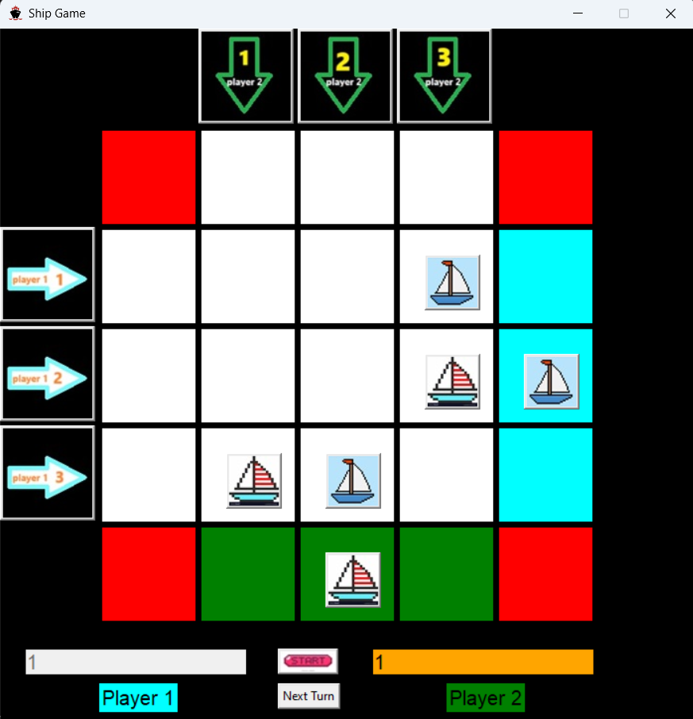

# Ship Battle Game

A simple turn-based ship game built using Python.
This project was developed as part of a **university bp final project**.

## Requirements

Make sure you have the following Python packages installed before running the game:

```bash
pip install tkinter
pip install Pillow
pip install playsound
```

## How to Play

- Click the **Start** button to begin the game.  
  ⚠️ Due to the use of the `playsound` library, the intro music may take **2–3 seconds** to play. Please wait for it to finish before interacting.

- The game progresses based on **player inputs**.  
  After each player takes an action, you must click the **Next Turn** button to allow the next player to proceed.

- If a player is supposed to **lose their turn**, they must still enter a valid input.  
  The game will then notify them that they are not allowed to move this round.

- **Ship images** are embedded inside buttons.  
  Clicking on a ship button will play a **ship horn sound**. Again, please wait **2–3 seconds** for the sound to complete.

## Notes

- This game is a basic example of Python GUI programming using `tkinter`.
- Sound effects and image assets are included to enhance the user experience.

## Game UI Picture 

